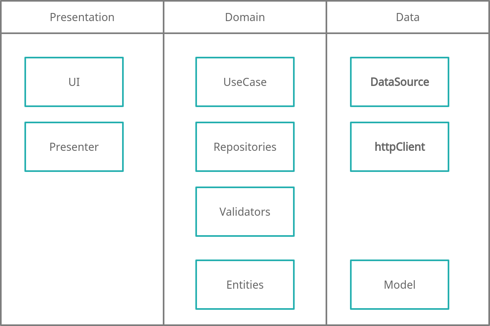

[](https://github.com/CabraKill/HiHome/actions/workflows/linux-artifac.yml)
[](https://github.com/CabraKill/HiHome/actions/workflows/android-artifact.yml)
[](https://github.com/CabraKill/HiHome/actions/workflows/web-deploy.yml)
# HiHome
HiHome app for home system

# Clean Architecture




# Firestore 🧡
Currently, the proposed scheme is described below. The main objectives are:
* An unit has many users
* An unit has many sections
* An user has many units
* A section has many subcollections of sections


# build obfuscate
```bash
flutter build apk --obfuscate --split-debug-info=hihome/debug-info
```

## Contributors
Thanks to:
* [@caiovini64](https://github.com/caiovini64) - for setting up the draggable use of devices. Well done, body.